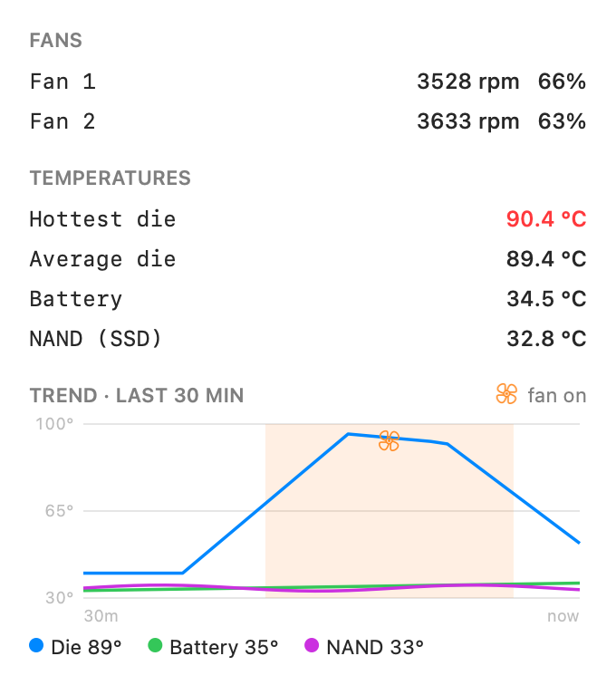

# fanmon

> This started as a side project when my M5 suddenly got very hot and kept
> sleeping quicker than I could see what was making it sleep — now I get a
> warning first.

A tiny native macOS **menu bar** widget that shows live temperature and fan RPM
for Apple Silicon Macs (built and tested on an M5 Max).


**Menu bar title:** a thermometer + the headline temperature, e.g. `🌡 49°`
(kept compact — fan speeds live in the dropdown). The thermometer and
temperature are colour-coded by heat:

| State | Temp      | Colour            |
|-------|-----------|-------------------|
| cool  | < 70 °C   | neutral (passive) |
| warm  | 70–89 °C  | orange            |
| hot   | ≥ 90 °C   | red               |

The **headline** temperature is the hottest of the die / battery / NAND (SSD).

**Click** it for a compact panel (full-strength text, custom-drawn — no per-die
noise), ending in a 30-minute trend graph of die-average, battery, and NAND.
Periods when a fan was running are marked with an orange band and a fan icon:



_(GIFs/screenshots above are generated headlessly from the real drawing code —
see `--render` / `--render-gif` under [Diagnostics](#diagnostics).)_

## History log

Readings are sampled **once per minute** and kept for the **last 30 minutes**,
persisted to `~/Library/Application Support/fanmon/history.csv` so the trend
graph survives relaunches/reboots.

## How it reads sensors

Apple Silicon splits these across two subsystems, and fanmon reads both
directly — **no `sudo`, no kernel extension, no entitlements**:

- **Fans** — the SMC (`AppleSMC` IOKit user client), keys `FNum`, `F<n>Ac/Mn/Mx`.
- **Temperatures** — the IOKitHID thermal sensors (usage page `0xff00`,
  usage `0x05`). The classic SMC `T…` temperature keys don't exist on M-series;
  temps come through `IOHIDServiceClientCopyEvent`. Note the client must be made
  with the private `IOHIDEventSystemClientCreate` — the public
  `CreateSimpleClient` enumerates sensors but never delivers readings.

Nothing is hardcoded to a particular chip: fan count and sensors are discovered
at runtime, so it works across Apple Silicon (M1–M5). Fans are also readable on
Intel Macs, but temperatures there use a different (SMC) path that isn't
implemented here.

## Safety & privacy

fanmon is **monitor-only** and built to be safe to run:

- **Read-only.** It reads temperature and fan sensors. It does **not** control
  fan speed or write anything to hardware, so it cannot damage your Mac.
- **No elevated privileges.** No `sudo`, no kernel extension, no entitlements.
- **No network, no telemetry.** Nothing leaves your machine. The only file it
  writes is a local history log at
  `~/Library/Application Support/fanmon/history.csv`.
- **Open source, MIT-licensed**, provided "as is" without warranty.

It uses a private Apple API to read Apple Silicon thermal sensors (the only way
to get them without `sudo`). Consequences: it can't ship on the Mac App Store,
and a future macOS could change those symbols — in which case it degrades
gracefully (shows no temperatures) rather than breaking.

Two safe ways to install: **download the notarized release** (signed with a
Developer ID and checked by Apple), or **build it yourself from source** — where
you run only code you can read.

## Install

- **Notarized download:** grab `Fanmon-<version>.dmg` from the
  [latest release](https://github.com/Modulo17/fanmon/releases/latest), open it,
  and drag **Fanmon** into Applications. It's Developer-ID-signed and notarized,
  so it opens without Gatekeeper warnings. Verify it with
  `shasum -a 256 -c SHA256SUMS` if you like.
- **From source:** see [Build](#build) below. (The open-source build uses the
  placeholder bundle id `com.example.fanmon`; the notarized download uses the
  maintainer's own.)

## Requirements

- **Run:** macOS 13 (Ventura) or later, Apple Silicon (M1–M5).
- **Build:** Xcode 26 / the macOS 26 SDK or newer — the IOKit HID thermal
  declarations used here are public as of that SDK. Older SDKs may not compile
  without re-adding the private declarations. (`xcode-select --install` gives you
  the Command Line Tools.)

## Build

```bash
./build.sh
```

Produces `build/Fanmon.app` (a menu-bar-only app — `LSUIElement`, no Dock icon).

## Run

```bash
open build/Fanmon.app
```

Or print a one-shot reading to the terminal without the menu bar:

```bash
./build/Fanmon.app/Contents/MacOS/fanmon --dump
```

## Customising the bundle identifier

The bundle ID is a neutral placeholder, `com.example.fanmon`. To rebrand it to
your own reverse-DNS domain, edit `BUNDLE_ID` at the top of `build.sh`. If you
install a login agent (below), give the agent's `Label` the **same** value.

## Start automatically at login

Move the app somewhere permanent first (e.g. symlink it into `/Applications`):

```bash
ln -sfn "$PWD/build/Fanmon.app" /Applications/Fanmon.app
```

**Simple:** System Settings → General → Login Items → **＋** → select the app.

**Robust (auto-restart on crash):** create
`~/Library/LaunchAgents/<BUNDLE_ID>.plist` with `Label` = your `BUNDLE_ID`,
`ProgramArguments` = `[/Applications/Fanmon.app/Contents/MacOS/fanmon]`,
`RunAtLoad` = true, and `KeepAlive` = `{ SuccessfulExit = false }` (so a manual
Quit is respected). Load it with:

```bash
launchctl bootstrap gui/$(id -u) ~/Library/LaunchAgents/<BUNDLE_ID>.plist
```

## Releasing (maintainer)

`packaging/release.sh <version>` builds, Developer-ID-signs (Hardened Runtime),
notarizes, and staples both the `.app` and a `.dmg`. Configure signing in
`packaging/release.env` (copy from `packaging/release.env.example` — it's
gitignored). Requires a Developer ID Application certificate and an App Store
Connect API key.

## Files

- `Sources/main.swift` — SMC reader, thermal reader, and the menu bar app.
- `bridge/fanmon-bridge.h` — declares the private IOKit symbols + SMC structs.
- `build.sh` — compiles and assembles the `.app` bundle.
- `packaging/` — Developer ID signing + notarization release pipeline.
- `LICENSE` — MIT.

## Diagnostics

```bash
fanmon --dump                  # one-shot text reading
fanmon --render <png> [--dark]  # render the panel to an image
fanmon --render-gif <gif>       # render the animated demo (used in this README)
fanmon --render-title <png>     # preview the menu bar title states
```
